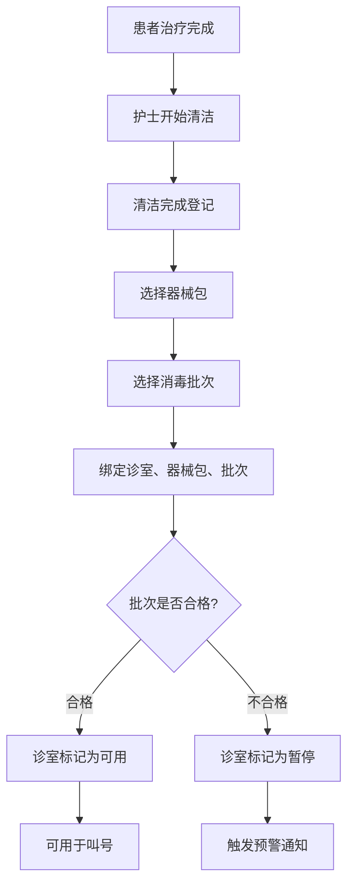
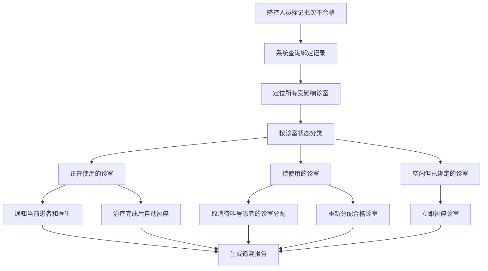

## 1. 产品概述

口腔门诊器械消毒批次追溯系统，实现消毒批次与诊室周转的全链路绑定。通过将器械包、消毒批号与诊室绑定，在消毒批次不合格时快速定位受影响诊室和患者，自动暂停相关诊室，并确保急诊插单也经过严格的消毒合格校验。

- 解决问题：消毒批次追溯缺失、不合格批次无法快速定位、急诊插单绕过消毒校验
- 目标用户：护士、医生、护士长、感控管理人员
- 核心价值：保障医疗安全、快速响应消毒事故、实现全流程可追溯

## 2. 核心功能

### 2.1 用户角色

| 角色 | 注册方式 | 核心权限 |
|------|----------|----------|
| 护士 | 系统账号 | 登记消毒记录、绑定消毒批次、执行清洁操作 |
| 医生 | 系统账号 | 叫号接诊、申请诊室、查看消毒状态 |
| 护士长 | 系统账号 | 批次质量管理、暂停/恢复诊室、查看追溯时间线 |
| 感控人员 | 系统账号 | 标记不合格批次、追溯受影响范围、质量审计 |

### 2.2 功能模块

1. **消毒批次管理**：批次录入、合格判定、不合格批次追溯
2. **诊室绑定管理**：器械包与消毒批号绑定到诊室、绑定历史查询
3. **应急处理中心**：不合格批次自动暂停、受影响诊室/患者定位
4. **急诊插单校验**：消毒合格校验、设备需求匹配、优先级调度
5. **追溯时间线**：叫号、清洁、器械、暂停、恢复全链路可视化

### 2.3 页面详情

| 页面名称 | 模块名称 | 功能描述 |
|-----------|-------------|---------------------|
| 消毒批次管理 | 批次列表 | 查看所有消毒批次，支持按批号、日期、状态筛选 |
| 消毒批次管理 | 批次录入 | 录入新消毒批次，包含批号、消毒日期、有效期、器械包清单 |
| 消毒批次管理 | 不合格判定 | 标记批次不合格，录入原因，系统自动触发追溯 |
| 诊室绑定管理 | 绑定操作 | 清洁完成后选择器械包和消毒批号绑定到诊室 |
| 诊室绑定管理 | 绑定历史 | 查看每个诊室的历史绑定记录，支持按时间范围查询 |
| 应急处理中心 | 批次追溯 | 输入不合格批号，一键定位所有受影响诊室和患者 |
| 应急处理中心 | 批量暂停 | 自动暂停所有使用不合格批次的诊室，记录暂停原因 |
| 急诊插单管理 | 插单申请 | 填写急诊患者信息、选择医生、设备需求 |
| 急诊插单管理 | 智能匹配 | 系统自动筛选消毒合格且满足设备需求的诊室 |
| 追溯时间线 | 诊室时间线 | 按诊室展示叫号、清洁、器械更换、暂停、恢复的完整时间线 |
| 追溯时间线 | 全局时间线 | 全诊室汇总时间线，支持按事件类型筛选 |

## 3. 核心流程

### 3.1 消毒批次绑定流程

护士完成诊室清洁后，选择本次使用的器械包和对应的消毒批号，系统将三者绑定。只有绑定完成且消毒批次合格的诊室才能用于叫号接诊。



### 3.2 不合格批次追溯流程

当某个消毒批次被判定为不合格时，系统自动追溯所有使用该批次的诊室，区分正在使用和即将使用的患者，自动暂停相关诊室并通知相关人员。



### 3.3 急诊插单校验流程

急诊患者插单时，必须经过消毒合格校验和设备需求匹配，只有满足所有条件的诊室才能分配给急诊患者。

```mermaid
flowchart TD
    A[提交急诊插单申请] --> B[输入患者信息和设备需求]
    B --> C[系统筛选候选诊室]
    C --> D[校验消毒状态]
    D -->{消毒合格?}
    D -->|否| E[排除该诊室]
    D -->|是| F[校验设备配置]
    F -->{满足需求?}
    F -->|否| E
    F -->|是| G[加入可用诊室列表]
    E --> H{还有候选诊室?}
    G --> H
    H -->|是| I[按优先级排序]
    H -->|否| J[提示无可用诊室]
    I --> K[分配最优诊室]
    K --> L[自动叫号]
```

## 4. 用户界面设计

### 4.1 设计风格

- **主色调**：医疗蓝 (#165DFF) 作为主色，代表专业和信任
- **警示色**：紧急红 (#F53F3F) 用于不合格批次和暂停状态，警示橙 (#FF7D00) 用于待处理事项
- **成功色**：健康绿 (#00B42A) 用于消毒合格和正常状态
- **中性色**：冷灰系列 (#86909C) 用于文字和背景，营造专业感

- **按钮风格**：圆角8px，悬停有阴影变化，点击有缩放反馈
- **字体**：主字体使用 PingFang SC，数字和编码使用等宽字体 JetBrains Mono
- **布局风格**：卡片式布局，清晰的信息层级，左侧导航+右侧内容区
- **图标风格**：使用 Lucide 线性图标，保持统一的2px线条粗细

### 4.2 页面设计概述

| 页面名称 | 模块名称 | UI 元素 |
|-----------|-------------|-------------|
| 消毒批次管理 | 批次列表 | 数据表格、状态标签、筛选器、批量操作按钮 |
| 消毒批次管理 | 不合格判定 | 模态弹窗、原因输入框、影响范围预览、确认按钮 |
| 应急处理中心 | 批次追溯 | 搜索框、追溯结果卡片、受影响诊室列表、患者列表、暂停按钮 |
| 急诊插单管理 | 智能匹配 | 表单输入、匹配进度动画、可用诊室卡片、选择确认 |
| 追溯时间线 | 诊室时间线 | 垂直时间线、事件节点、彩色状态标记、悬停详情、缩放控制 |

### 4.3 响应式

- 桌面端优先设计，支持 1920px 及以上分辨率
- 平板端自适应，卡片网格自动调整列数
- 移动端折叠导航，表格支持横向滚动

### 4.4 交互动效

- 批次追溯时的波纹扩散动画，模拟影响范围
- 时间线节点的渐进式加载动画
- 诊室状态变化的过渡动画
- 紧急告警的脉冲闪烁效果
- 表单校验的实时反馈动画
