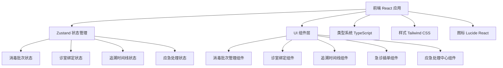
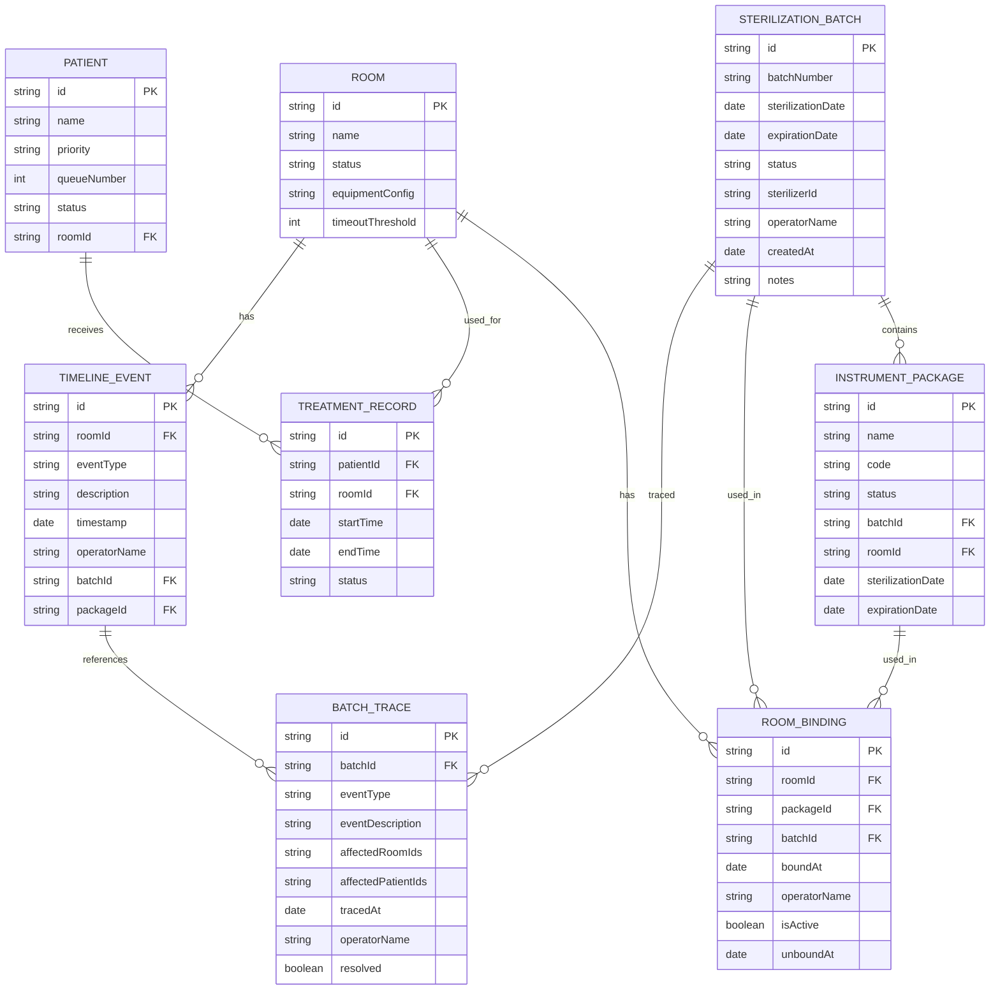

## 1. 架构设计



## 2. 技术描述

- **前端框架**：React@18.3.1 + TypeScript@5.8.3
- **构建工具**：Vite@6.3.5
- **状态管理**：Zustand@5.0.3
- **样式方案**：Tailwind CSS@3.4.17
- **路由管理**：React Router DOM@7.3.0
- **图标库**：Lucide React@0.511.0
- **工具库**：clsx@2.1.1 + tailwind-merge@3.0.2
- **后端**：纯前端 Mock 数据，无真实后端服务
- **数据库**：内存状态存储，使用 Zustand 持久化逻辑

## 3. 路由定义

| 路由 | 用途 |
|-------|---------|
| / | 首页 - 诊室总览、叫号队列、消毒记录、器械管理 |
| /batch | 消毒批次管理 - 批次列表、录入、不合格判定 |
| /binding | 诊室绑定管理 - 器械包与消毒批次绑定操作 |
| /trace | 追溯时间线 - 全流程可追溯时间线展示 |
| /emergency | 急诊插单 - 急诊患者插单与智能匹配 |
| /response | 应急处理中心 - 不合格批次追溯与批量处理 |

## 4. 数据模型

### 4.1 数据模型定义



### 4.2 TypeScript 类型定义扩展

```typescript
// 消毒批次状态
export type BatchStatus = 'pending' | 'qualified' | 'unqualified' | 'expired';

// 消毒批次
export interface SterilizationBatch {
  id: string;
  batchNumber: string;
  sterilizationDate: Date;
  expirationDate: Date;
  status: BatchStatus;
  sterilizerId: string;
  sterilizerName: string;
  operatorName: string;
  createdAt: Date;
  notes?: string;
  packageIds: string[];
  unqualifiedReason?: string;
  unqualifiedAt?: Date;
}

// 诊室绑定记录
export interface RoomBinding {
  id: string;
  roomId: string;
  roomName: string;
  packageId: string;
  packageName: string;
  batchId: string;
  batchNumber: string;
  boundAt: Date;
  operatorName: string;
  isActive: boolean;
  unboundAt?: Date;
}

// 批次追溯结果
export interface BatchTraceResult {
  id: string;
  batchId: string;
  batchNumber: string;
  tracedAt: Date;
  operatorName: string;
  affectedRooms: {
    roomId: string;
    roomName: string;
    status: RoomStatus;
    currentPatientId?: string;
    currentPatientName?: string;
    bindingId: string;
  }[];
  affectedPatients: {
    patientId: string;
    patientName: string;
    roomId: string;
    roomName: string;
    status: 'in-treatment' | 'waiting';
  }[];
  resolved: boolean;
  resolvedAt?: Date;
}

// 追溯时间线事件（扩展）
export interface TimelineEvent {
  id: string;
  roomId: string;
  eventType: 'patient-enter' | 'patient-exit' | 'cleaning-start' | 'cleaning-complete' | 
             'maintenance-start' | 'maintenance-end' | 'pause' | 'resume' |
             'package-bound' | 'package-unbound' | 'batch-qualified' | 'batch-unqualified';
  timestamp: Date;
  description: string;
  operatorName: string;
  batchId?: string;
  batchNumber?: string;
  packageId?: string;
  packageName?: string;
}

// 急诊插单请求
export interface EmergencyInsertRequest {
  id: string;
  patientName: string;
  patientPriority: 'emergency';
  doctorId: string;
  doctorName: string;
  equipmentRequirements: string[];
  requestedAt: Date;
  status: 'pending' | 'approved' | 'rejected' | 'completed';
  matchedRoomId?: string;
  matchedRoomName?: string;
  rejectionReason?: string;
}

// 设备配置
export interface EquipmentRequirement {
  id: string;
  name: string;
  category: string;
}

// Store 扩展
export interface ClinicStore {
  // ... 原有字段 ...
  
  // 消毒批次
  sterilizationBatches: SterilizationBatch[];
  
  // 诊室绑定
  roomBindings: RoomBinding[];
  
  // 批次追溯
  batchTraces: BatchTraceResult[];
  
  // 急诊插单请求
  emergencyRequests: EmergencyInsertRequest[];
  
  // 设备配置
  equipmentRequirements: EquipmentRequirement[];
  
  // 消毒批次操作
  addSterilizationBatch: (batch: Omit<SterilizationBatch, 'id' | 'createdAt'>) => void;
  markBatchQualified: (batchId: string, operatorName: string) => void;
  markBatchUnqualified: (batchId: string, reason: string, operatorName: string) => BatchTraceResult;
  
  // 诊室绑定操作
  bindPackageToRoom: (roomId: string, packageId: string, batchId: string, operatorName: string) => { success: boolean; message: string };
  unbindPackageFromRoom: (bindingId: string, operatorName: string) => void;
  getActiveBindingsByRoom: (roomId: string) => RoomBinding[];
  
  // 批次追溯
  traceBatch: (batchId: string, operatorName: string) => BatchTraceResult;
  resolveBatchTrace: (traceId: string, operatorName: string) => void;
  
  // 急诊插单
  submitEmergencyRequest: (request: Omit<EmergencyInsertRequest, 'id' | 'requestedAt' | 'status'>) => { success: boolean; message: string; matchedRooms?: Room[] };
  processEmergencyRequest: (requestId: string, approved: boolean, roomId?: string, reason?: string) => void;
  
  // 校验扩展
  checkRoomSterilizationStatus: (roomId: string) => { isQualified: boolean; reason?: string; batchId?: string };
  checkRoomEquipmentMatch: (roomId: string, requirements: string[]) => { isMatch: boolean; missingEquipment?: string[] };
  
  // 查询
  getQualifiedBatches: () => SterilizationBatch[];
  getAvailablePackagesWithBatch: () => (InstrumentPackage & { batch?: SterilizationBatch })[];
  getRoomTimelineWithBatch: (roomId: string) => TimelineEvent[];
}
```

## 5. 核心业务逻辑设计

### 5.1 消毒批次绑定校验流程

```typescript
function bindPackageToRoom(roomId: string, packageId: string, batchId: string, operatorName: string) {
  // 1. 校验诊室状态
  const room = rooms.find(r => r.id === roomId);
  if (!room) return { success: false, message: '诊室不存在' };
  if (room.status !== 'cleaning') return { success: false, message: '只有清洁中的诊室才能绑定器械包' };
  
  // 2. 校验器械包状态
  const pkg = instrumentPackages.find(p => p.id === packageId);
  if (!pkg) return { success: false, message: '器械包不存在' };
  if (pkg.status !== 'available') return { success: false, message: '器械包不可用' };
  
  // 3. 校验消毒批次状态
  const batch = sterilizationBatches.find(b => b.id === batchId);
  if (!batch) return { success: false, message: '消毒批次不存在' };
  if (batch.status !== 'qualified') return { success: false, message: '消毒批次不合格，不能绑定' };
  if (new Date() > batch.expirationDate) return { success: false, message: '消毒批次已过期' };
  
  // 4. 校验批次包含该器械包
  if (!batch.packageIds.includes(packageId)) {
    return { success: false, message: '该器械包不属于此消毒批次' };
  }
  
  // 5. 取消原有绑定
  const existingBinding = roomBindings.find(b => b.roomId === roomId && b.isActive);
  if (existingBinding) {
    unbindPackageFromRoom(existingBinding.id, operatorName);
  }
  
  // 6. 创建新绑定
  const newBinding: RoomBinding = {
    id: generateId(),
    roomId,
    roomName: room.name,
    packageId,
    packageName: pkg.name,
    batchId,
    batchNumber: batch.batchNumber,
    boundAt: new Date(),
    operatorName,
    isActive: true,
  };
  
  // 7. 更新器械包状态
  updateInstrumentPackageStatus(packageId, 'in-use', roomId);
  
  // 8. 添加时间线事件
  addTimelineEvent({
    roomId,
    eventType: 'package-bound',
    description: `绑定器械包 ${pkg.name}，消毒批次 ${batch.batchNumber}`,
    operatorName,
    batchId,
    packageId,
  });
  
  return { success: true, message: '绑定成功' };
}
```

### 5.2 不合格批次追溯逻辑

```typescript
function markBatchUnqualified(batchId: string, reason: string, operatorName: string): BatchTraceResult {
  // 1. 更新批次状态
  const now = new Date();
  updateBatchStatus(batchId, 'unqualified', reason, now);
  
  // 2. 执行追溯
  const traceResult = traceBatch(batchId, operatorName);
  
  // 3. 自动处理受影响诊室
  traceResult.affectedRooms.forEach(room => {
    if (room.status === 'occupied') {
      // 正在使用的诊室：添加标记，治疗完成后自动暂停
      markRoomForAutoPause(room.roomId, `消毒批次 ${traceResult.batchNumber} 不合格`);
    } else if (room.status === 'available') {
      // 可用诊室：立即暂停
      pauseRoom(room.roomId, `消毒批次 ${traceResult.batchNumber} 不合格`, operatorName);
    }
  });
  
  // 4. 取消受影响的待叫号患者分配
  traceResult.affectedPatients
    .filter(p => p.status === 'waiting')
    .forEach(patient => {
      cancelPatientRoomAssignment(patient.patientId);
    });
  
  // 5. 添加时间线事件
  traceResult.affectedRooms.forEach(room => {
    addTimelineEvent({
      roomId: room.roomId,
      eventType: 'batch-unqualified',
      description: `消毒批次 ${traceResult.batchNumber} 被判定不合格`,
      operatorName,
      batchId,
    });
  });
  
  return traceResult;
}
```

### 5.3 急诊插单智能匹配逻辑

```typescript
function submitEmergencyRequest(request: Omit<EmergencyInsertRequest, 'id' | 'requestedAt' | 'status'>) {
  const now = new Date();
  
  // 1. 筛选所有候选诊室
  const candidateRooms = rooms.filter(room => {
    // a. 基础可用校验
    const basicCheck = canRoomAcceptPatient(room.id);
    if (!basicCheck.canAccept) return false;
    
    // b. 消毒批次合格校验
    const sterilizationCheck = checkRoomSterilizationStatus(room.id);
    if (!sterilizationCheck.isQualified) return false;
    
    // c. 设备需求匹配校验
    const equipmentCheck = checkRoomEquipmentMatch(room.id, request.equipmentRequirements);
    if (!equipmentCheck.isMatch) return false;
    
    return true;
  });
  
  // 2. 按优先级排序
  const sortedRooms = candidateRooms.sort((a, b) => {
    // 优先选择设备配置完全匹配的
    // 其次选择空闲时间最长的
    return 0;
  });
  
  if (sortedRooms.length === 0) {
    return { success: false, message: '没有满足消毒合格和设备需求的可用诊室' };
  }
  
  // 3. 创建急诊插单请求
  const newRequest: EmergencyInsertRequest = {
    ...request,
    id: generateId(),
    requestedAt: now,
    status: 'pending',
  };
  
  return {
    success: true,
    message: `找到 ${sortedRooms.length} 个可用诊室`,
    matchedRooms: sortedRooms,
  };
}
```

## 6. 组件清单

| 组件名称 | 文件路径 | 职责描述 |
|-----------|----------|----------|
| SterilizationBatchList | src/components/SterilizationBatchList.tsx | 消毒批次列表展示与管理 |
| SterilizationBatchForm | src/components/SterilizationBatchForm.tsx | 消毒批次录入表单 |
| UnqualifiedBatchModal | src/components/UnqualifiedBatchModal.tsx | 不合格批次判定弹窗 |
| RoomBindingPanel | src/components/RoomBindingPanel.tsx | 诊室绑定操作面板 |
| BindingHistoryTable | src/components/BindingHistoryTable.tsx | 绑定历史记录表格 |
| TraceTimeline | src/components/TraceTimeline.tsx | 追溯时间线组件 |
| EmergencyInsertForm | src/components/EmergencyInsertForm.tsx | 急诊插单申请表单 |
| RoomMatchResult | src/components/RoomMatchResult.tsx | 诊室智能匹配结果 |
| BatchTraceCenter | src/components/BatchTraceCenter.tsx | 批次追溯应急中心 |
| AffectedRoomList | src/components/AffectedRoomList.tsx | 受影响诊室列表 |
| AffectedPatientList | src/components/AffectedPatientList.tsx | 受影响患者列表 |
| BatchStatusBadge | src/components/BatchStatusBadge.tsx | 批次状态标签组件 |
